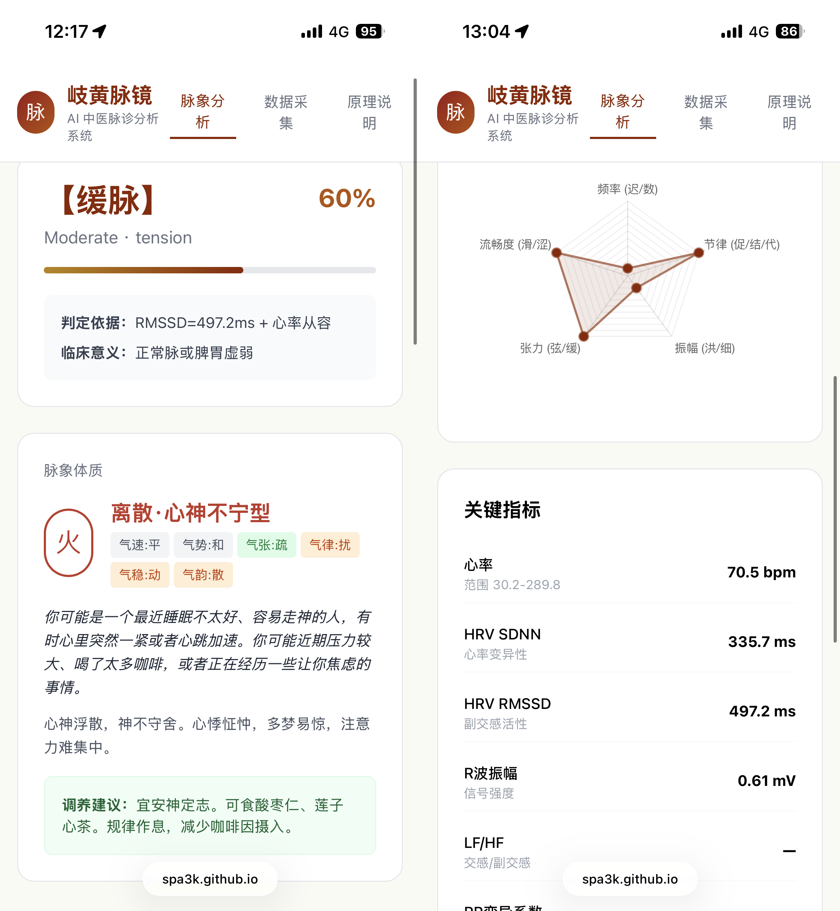

# 岐黄脉镜 — AI 中医脉诊系统

> 取名自《黄帝内经》岐伯与黄帝论医之典，"脉镜"寓意以现代传感器为镜、映射古法脉象。

基于 Apple Watch 生理数据的中医脉诊分析系统，结合中医经典脉学理论，通过特征提取 + 大模型 + Agent Skill 实现智能辨脉。

[](https://spa3k.github.io/tcm-pulse-web/)
[](LICENSE)

## 🚀 快速体验

### Web 版（快速诊断）

**适合场景**：快速查看单次心电图记录的脉象分析

👉 **[在线体验页面](https://spa3k.github.io/tcm-pulse-web/)**

- ✅ 纯前端，无需安装
- ✅ 隐私安全，数据本地处理
- ✅ 支持多记录选择
- ⚠️ 功能简化：仅基础脉象识别（11种可测脉象）
- ⚠️ 无 LLM 辅助辨证和深度分析

### Skill 版（完整诊断流程）⭐ 推荐

**适合场景**：深度分析、趋势追踪、辨证论治、知识库检索

```bash
# 安装依赖
cd tcm-pulse-diagnosis
pip install flask pandas neurokit2 scipy numpy

# 启动本地 Web 服务
python web/app.py
# 浏览器打开 http://localhost:5000
```

**完整功能**：
- ✅ 18 维特征提取（vs Web版基础判断）
- ✅ LLM 辅助辨证论治（Claude API）
- ✅ 知识库 RAG 检索（经典文献 + 教学视频）
- ✅ 体质推断与养生建议
- ✅ 相兼脉分析（如"弦滑脉→肝郁痰湿"）
- ✅ 多次记录趋势分析
- ✅ 溯源推荐（相关教学视频片段）

---

## 📊 功能对比

| 功能 | Web 快速版 | Skill 完整版 |
|------|-----------|------------|
| 基础脉象识别 | ✅ 11种 | ✅ 11种 + 辅助4种 |
| 特征维度 | 基础判断 | 18维完整提取 |
| LLM 辨证 | ❌ | ✅ Claude API |
| 知识库检索 | ❌ | ✅ RAG 检索 |
| 体质推断 | ❌ | ✅ |
| 相兼脉分析 | ❌ | ✅ |
| 趋势追踪 | ❌ | ✅ |
| 养生建议 | ❌ | ✅ |
| 视频溯源 | ❌ | ✅ |
| 部署方式 | 在线访问 | 本地运行 |
| 数据隐私 | 浏览器本地 | 本地 + API调用 |

---

## 🎯 核心思路

```
可穿戴传感器 → 数据导出 → 特征提取 → 脉象分类 → LLM辨证 → 可视化报告
```

## 🔬 二十八脉图解

### 可测脉象（11种，传感器可直接判定）

| 脉象 | 一句话释义 | 指下比喻 | 传感器特征 | 置信度 | 主病 |
|------|-----------|---------|-----------|--------|------|
| **迟脉** | 脉来迟缓，一息不足四至 | 老牛拉车 | HR < 60 bpm | 95% | 寒证、阳虚 |
| **数脉** | 脉来急促，一息五至以上 | 急鼓催征 | HR > 90 bpm | 95% | 热证、阴虚 |
| **疾脉** | 脉来极快，一息七八至 | 走马奔腾 | HR > 120 bpm | 90% | 阳极阴竭 |
| **促脉** | 数而一止，止无定数 | 快鼓忽漏拍 | 快心率 + 不规则早搏 | 85% | 阳盛实热、瘀血 |
| **结脉** | 迟而一止，止无定数 | 慢步偶踉跄 | 慢心率 + 不规则停搏 | 85% | 阴盛气结、寒痰 |
| **代脉** | 脉来一止，止有定数 | 钟摆定时缺格 | 等间距规律性漏拍 | 85% | 脏气衰微 |
| **弦脉** | 端直以长，如按琴弦 | 绷紧的吉他弦 | RMSSD<20ms + LF/HF>2.0 | 65% | 肝胆病、痛证 |
| **缓脉** | 一息四至，从容不迫 | 散步悠然 | RMSSD>50ms + HR 60-75 | 60% | 平脉或脾虚 |
| **洪脉** | 脉体宽大，来盛去衰 | 波涛拍岸 | R波振幅 > 1.5mV | 55% | 气分热盛 |
| **细脉** | 脉细如线，应指分明 | 蚕丝一缕 | R波振幅 < 0.5mV | 55% | 气血两虚 |
| **滑脉** | 往来流利，如盘走珠 | 玉珠滚盘 | RR变异系数 < 0.03 | 50% | 痰湿、妊娠 |

### 辅助可测脉象（4种，Skill版支持）

| 脉象 | 一句话释义 | 指下比喻 | 可行性 | 主病 |
|------|-----------|---------|--------|------|
| **涩脉** | 往来艰涩，如刀刮竹 | 锉刀挫铁 | RR变异系数>0.10（低置信） | 气滞血瘀 |
| **紧脉** | 绷紧有力，如转绳索 | 拧紧的麻绳 | LF/HF>3.0 + 快心率（低置信） | 寒证、痛证 |
| **弱脉** | 沉细无力，按之欲绝 | 棉絮飘空 | R波<0.3mV + HR<65（低置信） | 阳气虚衰 |
| **微脉** | 极细极软，似有似无 | 蛛丝将断 | R波<0.1mV（极低置信） | 气血大虚 |

### 不可测脉象（13种，需压力/深度传感器）

浮脉、沉脉、伏脉、牢脉、濡脉、革脉、芤脉、散脉、长脉、短脉、动脉、实脉、虚脉

**弥补策略（Skill版）**：
1. 引导自述：用户手动按压手腕回答问题
2. LLM综合推理：结合可判定脉象 + 症状描述进行四诊合参
3. 硬件扩展：MAX30102 PPG传感器（可扩展覆盖至~20种）

---

## 📱 数据采集

完整教程请访问 [在线体验页面 - 数据采集](https://spa3k.github.io/tcm-pulse-web/)

### 快速步骤

1. **开启房颤功能**（首次）
   - iPhone 健康 App → 心脏 → 心电图(ECG) → 设置
   - Apple Watch 安装"心电图" App

2. **录制 ECG**
   - 静坐 5 分钟
   - 打开手表心电图 App
   - 手指按住表冠 30 秒

3. **导出数据**
   - iPhone 健康 App → 个人头像 → 导出所有健康数据
   - 保存到文件

4. **解压提取**
   - 文件 App 长按 `导出.zip` → 解压缩
   - 进入 `apple_health_export/electrocardiograms/`

5. **上传分析**
   - Web版：访问在线页面上传 CSV
   - Skill版：本地 Web 界面上传

---

## 🏗️ 技术架构

### 特征维度对比

| 维度 | 传统手表 | 本系统 |
|------|---------|--------|
| **频率** | 心率BPM（1维） | 均值心率 + 最大/最小 + 区间分布（3维） |
| **节律** | 无 | RR变异系数 + 早搏计数 + 停搏计数 + 规律检测（4维） |
| **振幅** | 无 | R波均值 + 标准差 + 变异系数（3维） |
| **张力** | "压力指数"（1维） | SDNN + RMSSD + pNN50 + LF/HF（4维） |
| **流畅度** | 无 | Poincaré SD1 + RR粗糙度（2维） |
| **波形** | 无 | QRS宽度 + 信号质量（2维） |
| **合计** | **2维** | **18维** |

### 分析深度对比

```
传统手表:  心率 + 压力指数 → "你今天压力有点大"
本系统:    18维特征 × 11种脉象 × 证候推理 → "弦数脉，肝火上炎，建议疏肝清热"
```

---

## 📂 项目结构

```
tcm-pulse-web/
├── index.html              # Web 快速版（纯前端）
├── src/                    # Skill 核心代码
│   ├── data_ingestion/     # HealthKit XML/ECG CSV 解析
│   ├── feature_extraction/ # 18维特征提取
│   ├── classification/     # 脉象分类器
│   ├── knowledge_base/     # 知识库管理
│   └── llm_pipeline/       # Claude API 辨证链
├── knowledge-base/         # 知识库数据
│   ├── structured/         # 28脉结构化JSON
│   ├── classical_texts/    # 经典文献
│   └── embeddings/         # FAISS向量索引
├── web/                    # Skill 本地Web界面
├── config/                 # 配置文件
├── scripts/                # 工具脚本
└── tests/                  # 测试用例
```

---

## 🛠️ Skill 完整安装

### 环境要求

- Python 3.8+
- Node.js 16+ (可选，用于前端开发)

### 安装步骤

```bash
# 1. 克隆项目
git clone https://github.com/SPA3K/tcm-pulse-web.git
cd tcm-pulse-web

# 2. 安装 Python 依赖
pip install flask pandas neurokit2 scipy numpy

# 3. 配置 Claude API（可选，用于 LLM 辨证）
export ANTHROPIC_API_KEY="your-api-key"

# 4. 启动服务
python web/app.py

# 5. 浏览器访问
open http://localhost:5000
```

### 知识库扩充（可选）

```bash
# 从教学视频提取知识
python scripts/video_ingestion.py --url "bilibili-url"

# 重建向量索引
python scripts/rebuild_embeddings.py
```

---

## 📸 示例结果

### Web 快速版

在线体验页面展示了基础的脉象分析功能，以下是实际使用截图：

<details>
<summary>点击查看 Web 版界面截图</summary>

**完整分析界面**

左侧展示了"缓脉"诊断结果，包含体质类型、身体表现和调养建议；右侧展示五维雷达图和关键指标：



> 💡 **提示**：Web 快速版提供基础的 11 种脉象识别和可视化，适合快速查看单次记录。完整的 18 维特征分析、LLM 辨证和知识库检索需要使用 Skill 完整版。

</details>

### Skill 完整版

**测试数据**：2026-05-09 录制的心电图（30秒，512Hz采样）

**分析过程**：

```bash
$ python3 analyze_ecg.py

📊 正在解析 ECG 数据...
✅ 数据加载完成: 15360 个采样点
   采样率: 512 Hz
   时长: 30.0 秒

🔬 正在提取 18 维特征...
✅ 特征提取完成

🏥 正在进行脉象分类...
✅ 识别到 2 种脉象特征
```

**诊断报告**：

<details>
<summary>点击查看完整报告</summary>

```
============================================================
岐黄脉镜 - 中医脉诊分析报告
============================================================

【基本信息】
  姓名: ***
  记录时间: 2026-05-09 09:24:39 +0800
  Apple 分类: 窦性心律
  症状: 无
  数据时长: 30.0 秒

【18维特征提取】
  ├─ 频率维度:
  │   平均心率: 88.3 bpm
  │   最大心率: 135.9 bpm
  │   最小心率: 64.0 bpm
  ├─ 节律维度:
  │   RR变异系数: 0.114
  │   早搏次数: 4
  │   停搏次数: 2
  ├─ 振幅维度:
  │   R波平均振幅: 517.4 µV
  │   R波振幅标准差: 170.3 µV
  ├─ 张力维度 (HRV):
  │   SDNN: 78.2 ms
  │   RMSSD: 125.7 ms
  │   pNN50: 16.7 %
  └─ 流畅度维度:
      Poincaré SD1: 88.9 ms
      RR粗糙度: 59.1 ms

【脉象诊断】
  【主脉】结脉 (置信度: 85%)
    证据: 慢心率 + 早搏 4 次
    临床意义: 阴盛气结、寒痰

  【兼脉】洪脉 (置信度: 55%)
    证据: R波振幅 517.4 µV，波形宽大
    临床意义: 气分热盛

============================================================
⚠️  本分析仅供参考，不能替代专业中医师诊断
============================================================
```

</details>

**诊断解读**：

1. **主脉 - 结脉**（阴盛气结、寒痰）
   - 检测到 4 次早搏（心律不齐）
   - RR 间期变异系数 0.114，节律不规则
   - 符合"迟而一止，止无定数"的结脉特征

2. **兼脉 - 洪脉**（气分热盛）
   - R 波振幅 517.4 µV，显著高于正常范围
   - 符合"脉体宽大，来盛去衰"的洪脉特征

3. **相兼脉分析**（仅 Skill 版支持）
   - 结脉 + 洪脉 → 可能提示：寒热错杂，正邪交争
   - 建议：结合问诊了解是否有咳嗽、痰多、胸闷等症状

4. **养生建议**（仅 Skill 版支持）
   - 注意保暖，避免寒凉饮食
   - 适当化痰理气（如陈皮、半夏）
   - 建议专业中医师辨证后调理

---

## 🔮 望闻问切 Skillset 规划

| 诊法 | Skill | 数据来源 | 状态 |
|------|-------|---------|------|
| **切诊（脉诊）** | `岐黄脉镜` | 手表心率/HRV/ECG + 脉诊知识库 | ✅ 已实现 |
| **望诊** | `望神观色` | 摄像头面色/舌象分析 | 📋 规划中 |
| **闻诊** | `闻声辨气` | 麦克风语音/咳嗽/呼吸音 | 📋 规划中 |
| **问诊** | `问症知源` | 结构化问诊对话 + 症状图谱 | 📋 规划中 |
| **四诊合参** | `四诊合参` | 综合四诊 → 辨证论治 | 📋 规划中 |

---

## 🤝 贡献指南

欢迎提交 Issue 和 Pull Request！

- 报告 Bug：[GitHub Issues](https://github.com/SPA3K/tcm-pulse-web/issues)
- 功能建议：[Discussions](https://github.com/SPA3K/tcm-pulse-web/discussions)
- 代码贡献：Fork → Branch → Pull Request

### 贡献者

- **[SPA3K](https://github.com/SPA3K)** - 项目创建者与维护者
- **[Claude Sonnet 4.5](https://claude.ai)** - AI 协作开发者

感谢所有为本项目做出贡献的开发者！

---

## 📄 许可证

MIT License

---

## ⚠️ 免责声明

本系统仅供学习研究使用，不能替代专业医疗诊断。任何健康问题请咨询专业中医师或医疗机构。

---

## 📚 相关资源

- [Apple Health 导出指南](https://support.apple.com/zh-cn/HT203037)
- [中医脉诊基础知识](https://spa3k.github.io/tcm-pulse-web/)
- [NeuroKit2 文档](https://neuropsychology.github.io/NeuroKit/)
- [Claude API 文档](https://docs.anthropic.com/)

---

**Made with ❤️ by SPA3K**
